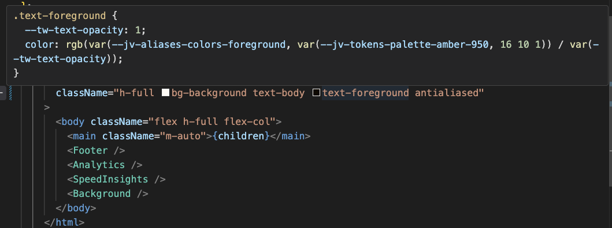

# themizer

Generate CSS3 custom properties based on a given theme with tokens and aliases serving as a reference.

## API

```ts
  import themizer from "themizer";

  const { aliases, medias, tokens, rules } = themizer(aliases, options?);
```

### Parameters

- **aliases**

  Object for basic `theme.rules` generation, and `theme.aliases` as a JavaScript reference.

  It's a function if `options.tokens` is provided, being passed as `aliases` parameter.

- **options?**

  - prefixAtoms?

    String to prefix all the generated CSS custom properties, accessed in `theme.rules`.

  - medias?

    Object with values as media queries and properties serving as its aliases.

    It's used to replace the responsive properties in the `aliases` object values.

    It's also accessed throught `theme.medias` as it is.

  - tokens?

    Object for advanced `theme.aliases` as function.

    It's also generates variables that can be referenced by `theme.tokens` in JavaScript.

### Return

- **theme**

  - aliases

    Object containing the same keys as `aliases` parameter, but returning its CSS custom properties.

  - medias?

    Object containing the `options.medias` to be also used as reference in JavaScript.

  - tokens?

    Object containing the same keys as `options.tokens` parameter, but returning its CSS custom properties.

  - rules

    Object containing style sheets the generated custom properties from `aliases` and `options.tokens`.

    - css

      String containing the custom properties as CSS format.

    - jss

      Object containing the custom properties as JSS format.

      > Needs to be injected at the top-level page application.

## Example

Create a file and provide any tokens and options based on the product's design system needs.

```tsx
// helpers/rgba.ts

export default function rgba(color: string, alpha: string) {
  return `color-mix(in srgb, ${color} calc(${alpha} * 100), transparent)`;
}

// src/lib/theme.ts

import themizer from 'themizer';
import rgba from 'helpers/rgba';

const theme = themizer(
  (tokens) => ({
    palette: {
      main: tokens.colors.amber[500],
      accent: [{ dark: tokens.colors.amber[400] }, tokens.colors.amber[600]],
      text: {
        primary: [{ dark: tokens.colors.white }, rgba(tokens.colors.black, tokens.alphas.primary)],
        secondary: [{ dark: rgba(tokens.colors.white, tokens.alphas.secondary) }, rgba(tokens.colors.black, tokens.alphas.secondary)],
      },
    },
    grid: {
      margin: [{ desktop: tokens.dimensions[40] }, tokens.dimensions[16]],
      gutter: tokens.dimensions[8],
    },
    typography: {
      headline: [{ desktop: tokens.dimensions[64] }, tokens.dimensions[40]],
      body: tokens.dimensions[16],
    },
    motion: {
      bounce: [{ motion: `${tokens.trans.duration.fast} ${tokens.trans.timing.bounce}` }],
      ease: [{ motion: `${tokens.trans.duration.fast} ${tokens.trans.timing.ease}` }],
    },
  }),
  {
    prefixAtoms: 'ds',
    medias: {
      desktop: '@media (min-width: 1024px)',
      dark: '@media (prefers-color-scheme: dark)',
      motion: '@media (prefers-reduced-motion: no-preference)',
    },
    tokens: {
      colors: {
        amber: {
          400: '#fbbf24',
          500: '#f59e0b',
          600: '#d97706',
        },
        white: '#fff',
        black: '#000',
      },
      alphas: {
        primary: 0.8,
        secondary: 0.6,
      },
      dimensions: {
        8: '0.5rem',
        16: '1rem',
        40: '2.5rem',
        64: '4rem',
      },
      font: {
        sans: 'sofia-pro',
        weight: {
          regular: 400,
          semibold: 600,
          bold: 800,
        },
      },
      trans: {
        timing: {
          bounce: 'cubic-bezier(0.5, -0.5, 0.25, 1.5)',
          ease: 'cubic-bezier(0.25, 0.1, 0.25, 1)',
        },
        duration: {
          fast: '200ms',
        },
      },
    },
  },
);
```

The generated custom properties from the last example would look like this.

> Note that the provided `prefixAtoms` ("ds") is being used. Otherwise, these custom properties would be just like `--tokens-*` for tokens and `--aliases-*` for aliases.

Generated styles within `theme.rules.css`:

```css
:root {
  /* Generated tokens */
  --ds-tokens-colors-amber-400: #fbbf24;
  --ds-tokens-colors-amber-500: #f59e0b;
  --ds-tokens-colors-amber-600: #d97706;
  --ds-tokens-colors-white: #fff;
  --ds-tokens-colors-black: #000;

  --ds-tokens-alphas-primary: 0.8;
  --ds-tokens-alphas-secondary: 0.6;

  --ds-tokens-dimensions-8: 0.5rem;
  --ds-tokens-dimensions-16: 1rem;
  --ds-tokens-dimensions-40: 2.5rem;

  --ds-tokens-font-sans: 'sofia-pro';
  --ds-tokens-font-weight-regular: 400;
  --ds-tokens-font-weight-semibold: 600;
  --ds-tokens-font-weight-bold: 800;

  --ds-tokens-trans-timing-bounce: cubic-bezier(0.5, -0.5, 0.25, 1.5);
  --ds-tokens-trans-duration-fast: 200ms;

  /* Generated aliases */
  --ds-aliases-palette-main: var(--ds-tokens-colors-amber-500);
  --ds-aliases-palette-accent: var(--ds-tokens-colors-amber-600);
  --ds-aliases-palette-text-primary:
    color-mix(
      in srgb,
      var(--ds-tokens-colors-black) calc(var(--ds-tokens-alphas-primary) * 100),
      transparent
    );
  --ds-aliases-palette-text-secondary:
    color-mix(
      in srgb,
      var(--ds-tokens-colors-black) calc(var(--ds-tokens-alphas-secondary) * 100),
      transparent
    );

  --ds-aliases-grid-margin: var(--ds-tokens-dimensions-16);
  --ds-aliases-grid-gutter: var(--ds-tokens-dimensions-8);

  --ds-aliases-typography-body: var(--ds-tokens-dimensions-16);
  --ds-aliases-typography-headline: var(--ds-tokens-dimensions-40);
}

@media (prefers-color-aliases: dark) {
  :root {
    --ds-aliases-palette-accent: var(--ds-tokens-colors-amber-400);
    --ds-aliases-palette-text-primary: var(--ds-tokens-colors-white);
    --ds-aliases-palette-text-secondary:
      color-mix(
        in srgb,
        var(--ds-tokens-colors-white) calc(var(--ds-tokens-alphas-secondary) * 100),
        transparent
      );
  }
}

@media (min-width: 1024px) {
  :root {
    --ds-aliases-grid-margin: var(--ds-tokens-dimensions-40);
    --ds-aliases-typography-headline: var(--ds-tokens-dimensions-64);
  }
}

@media (prefers-reduced-motion: no-preference) {
  :root {
    --ds-aliases-motion-bounce:
      var(--ds-tokens-trans-duration-fast)
      var(--ds-tokens-trans-timing-bounce);
  }
}
```

Generated styles within `theme.rules.jss`:

```ts
console.log(theme.rules.jss);

/*
{
  ':root': {
    '--ds-tokens-colors-amber-400': '#fbbf24',
    '--ds-tokens-colors-amber-500': '#f59e0b',
    '--ds-tokens-colors-amber-600': '#d97706',
    '--ds-tokens-colors-white': '#fff',
    '--ds-tokens-colors-black': '#000',
    '--ds-tokens-alphas-primary': 0.8,
    '--ds-tokens-alphas-secondary': 0.6,
    '--ds-tokens-dimensions-8': '0.5rem',
    '--ds-tokens-dimensions-16': '1rem',
    '--ds-tokens-dimensions-40': '2.5rem',
    '--ds-tokens-font-sans': 'sofia-pro',
    '--ds-tokens-font-weight-regular': 400,
    '--ds-tokens-font-weight-semibold': 600,
    '--ds-tokens-font-weight-bold': 800,
    '--ds-tokens-trans-timing-bounce': 'cubic-bezier(0.5, -0.5, 0.25, 1.5)',
    '--ds-tokens-trans-duration-fast': '200ms',
    '--ds-aliases-palette-main': 'var(--ds-tokens-colors-amber-500)',
    '--ds-aliases-palette-accent': 'var(--ds-tokens-colors-amber-600)',
    '--ds-aliases-palette-text-primary': 'color-mix(in srgb, var(--ds-tokens-colors-black) calc(var(--ds-tokens-alphas-primary) * 100), transparent)',
    '--ds-aliases-palette-text-secondary': 'color-mix(in srgb, var(--ds-tokens-colors-black) calc(var(--ds-tokens-alphas-secondary) * 100), transparent)',
    '--ds-aliases-grid-margin': 'var(--ds-tokens-dimensions-16)',
    '--ds-aliases-grid-gutter': 'var(--ds-tokens-dimensions-8)',
    '--ds-aliases-typography-body': 'var(--ds-tokens-dimensions-16)',
    '--ds-aliases-typography-headline': 'var(--ds-tokens-dimensions-40)',
  },
  '@media (prefers-color-aliases: dark)': {
    ':root': {
      '--ds-aliases-palette-accent': 'var(--ds-tokens-colors-amber-400)',
      '--ds-aliases-palette-text-primary': 'var(--ds-tokens-colors-white)',
      '--ds-aliases-palette-text-secondary': 'color-mix(in srgb, var(--ds-tokens-colors-white) calc(var(--ds-tokens-alphas-secondary) * 100), transparent)',
    },
  },
  '@media (min-width: 1024px)': {
    ':root': {
      '--ds-aliases-grid-margin': 'var(--ds-tokens-dimensions-40)',
      '--ds-aliases-typography-headline': 'var(--ds-tokens-dimensions-64)',
    },
  },
  '@media (prefers-reduced-motion: no-preference)': {
    ':root': {
      '--ds-aliases-motion-bounce': 'var(--ds-tokens-trans-duration-fast) var(--ds-tokens-trans-timing-bounce)',
    }
  },
}
*/
```

### Usage

The generated CSS custom properties needs to be indexed at the project's top-level file.

#### Next.js and Talwind CSS

1. Customize Tailwind CSS' default theme with the generated by `themizer`.

```ts
// tailwind.config.ts

import theme from './lib/theme';
import plugin from 'tailwindcss/plugin';
import defaultTheme from 'tailwindcss/defaultTheme';
import { type Config } from 'tailwindcss';
import { type CSSRuleObject } from 'tailwindcss/types/config';

const config = {
  content: ['./app/**/*.{tsx,ts,mdx}', './components/**/*.{tsx,ts,mdx}'],
  theme: {
    fontFamily: {
      sans: [
        theme.tokens.font.families.sans,
        '-apple-system-font',
        ...defaultTheme.fontFamily.sans,
      ],
    },
    colors: {
      transparent: 'transparent',
      current: 'currentColor',
      background: rgb(theme.aliases.colors.background),
      foreground: rgb(theme.aliases.colors.foreground),
    },
    fontSize: {
      body: [
        theme.aliases.typography.sm,
        {
          lineHeight: theme.aliases.typography.lg,
        },
      ],
    },
  },
  plugins: [
    plugin(({ addBase }) => {
      return addBase(theme.rules.jss as CSSRuleObject);
    }),
  ],
} satisfies Config;

export default config;
```

2. Apply the class names normally to style anything. And don't worry, intellisense will charmingly work.

```tsx
import type { Metadata, Viewport } from 'next';
import { Analytics } from '@vercel/analytics/react';
import { SpeedInsights } from '@vercel/speed-insights/next';
import theme from 'lib/theme';
import './global.css';
import { resolveAtom } from 'themizer';

export const viewport: Viewport = {
  themeColor: [
    {
      media: '(prefers-color-scheme: dark)',
      color: `rgb(${resolveAtom(theme.tokens.palette.amber[950])})`,
    },
    {
      media: '(prefers-color-scheme: light)',
      color: `rgb(${resolveAtom(theme.tokens.palette.amber[50])})`,
    },
  ],
};

export default function AppLayout({ children }: React.PropsWithChildren) {
  return (
    <html
      lang="en"
      className="h-full bg-background text-body text-foreground antialiased"
    >
      <body className="flex h-full flex-col">
        <main className="m-auto">{children}</main>
        <Analytics />
        <SpeedInsights />
      </body>
    </html>
  );
}
```

> ✨



#### Next.js and styled-jsx (native CSS-in-JS solution)

1. Create a **styled-jsx** [registry](https://nextjs.org/docs/app/building-your-application/styling/css-in-js#styled-jsx) to collect all CSS rules in a render and inject the theme rules in the document.

```tsx
// src/providers/StyledJsxProvider.tsx

'use client';

import { useState } from 'react';
import { useServerInsertedHTML } from 'next/navigation';
import { StyleRegistry, createStyleRegistry } from 'styled-jsx';
import theme from 'lib/theme';

export default function StyledJsxProvider({
  children,
}: React.PropsWithChildren) {
  const [styleRegistry] = useState(() => createStyleRegistry());

  useServerInsertedHTML(() => {
    const styles = styleRegistry.styles();

    styleRegistry.flush();

    return <>{styles}</>;
  });

  return (
    <StyleRegistry registry={styleRegistry}>
      <style jsx global>{`
        ${theme.rules}/* Other CSS styles, such as Reset, Normalize and so on. */
      `}</style>
      {children}
    </StyleRegistry>
  );
}
```

2. Wrap the children of the root layout with the style registry component.

```tsx
// src/app/layout.tsx

import type { Viewport } from 'next';
import { Analytics } from '@vercel/analytics/react';
import { SpeedInsights } from '@vercel/speed-insights/next';
import StyledJsxProvider from 'providers/StyledJsxProvider';
// There are also cool helper functions to get a custom property name or value.
import { resolveAtom, unwrapAtom } from 'themizer';

export const viewport: Viewport = {
  themeColor: [
    {
      media: '(prefers-color-scheme: dark)',
      color: resolveAtom(theme.tokens.colors.amber[400]), // #fbbf24
    },
    {
      media: '(prefers-color-scheme: light)',
      color: resolveAtom(theme.tokens.colors.amber[600]), // #d97706
    },
  ],
};

export default function RootLayout({ children }: React.PropsWithChildren) {
  return (
    <html
      lang="en"
      style={{
        [unwrapVar(trans.duration.fast) /* --ds-tokens-trans-duration-fast */]: '400ms',
      }}>
      <body>
        <StyledJsxProvider>
          {children}
          <Analytics />
          <SpeedInsights />
        </StyledJsxProvider>
      </body>
    </html>
  );
}
```

3. Implement components using the generated theme.

```tsx
// src/components/Title.tsx

'use client';

import theme from './lib/theme';

export default function Title({
  children,
  className = '',
  ...props
}: React.ComponentPropsWithoutRef<'h1'>) {
  return (
    <h1 className={`title ${className}`} {...props}>
      {children}
      <style jsx>{`
        .title {
          font-size: ${theme.aliases.typography.headline}; /* var(--ds-aliases-typography-headline, var(--ds-tokens-dimensions-40, 2.5rem)) */
          font-weight: ${theme.tokens.font.weight.bold}; /* var(--ds-tokens-font-weight-bold, 800) */
        }
      `}</style>
    </h1>
  );
}
```

4. Or anywhere else it's needed.

> No need to change de directive of a file to use theme.

```tsx
// src/app/page.tsx

import Title from 'components/Title';
import theme from 'lib/theme';

export default function Page() {
  return (
    <main>
      <Title>Styled with Styled JSX</Title>
    </main>
  );
}
```
